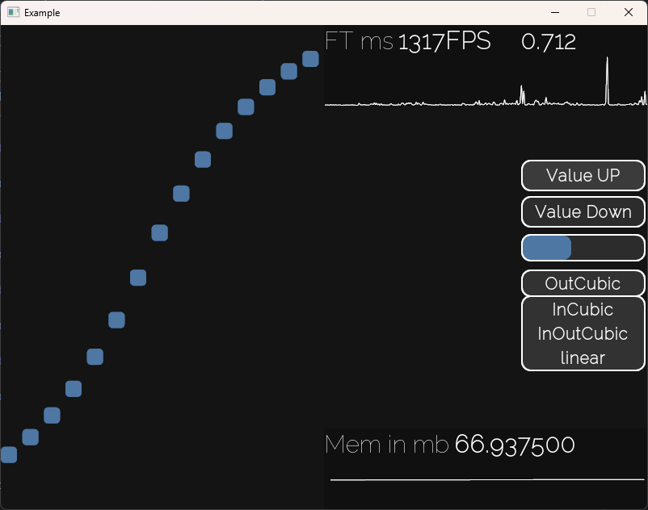

# BS-lib
Small Undone library that allows you to make your games easier.


# Features

## Multi-threaded animation engine

- Move animations  
- Size animations  
- Color animations  
- Rotate animations  
- View animations  
- Scale animations  

## Utils and classes

- Groups  
- Signals  
- TickRateController  
- Rounded rectangle  
- Simple logger  
- resources using bin2c
- Json Manager
- Scenes
- Other utilities
- PushButton
- ProgressBar
- Graph
- DropDown

## Debug features

- Complited Memory Graph
- Complited FrameTime Graph
- Cross-platform hardware usage information (for now – only RAM)  

## How to build

Firstly, you need to install SFML 2.6.2.  
If you use Linux or macOS – you can easily do it using your package manager.  
If you are using Windows – download it from the official site and set `SFML_DIR` and `SFML_BIN_DIR` in your `CMakeLists.txt`.

```bash
mkdir build
cd build
cmake ..
make -j$(nproc)
````

# TODO

* ~~JSON handler~~
* ~~Scene manager~~
* ~~hitboxes~~
* ~~more optimization in graphs~~
* ~~base widgets~~
* fix issue with roundedrect corner radius subsequence
* add more signals everywhere

> I don’t plan to continue active development on this project.